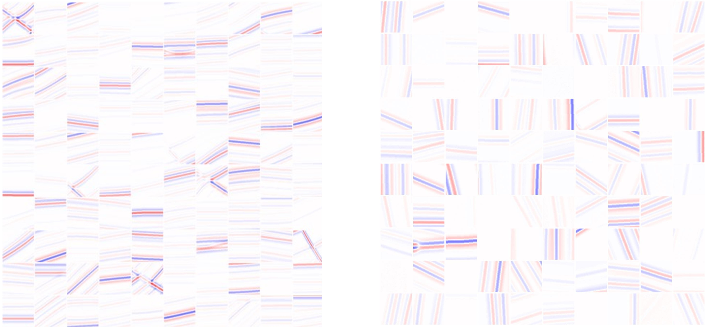
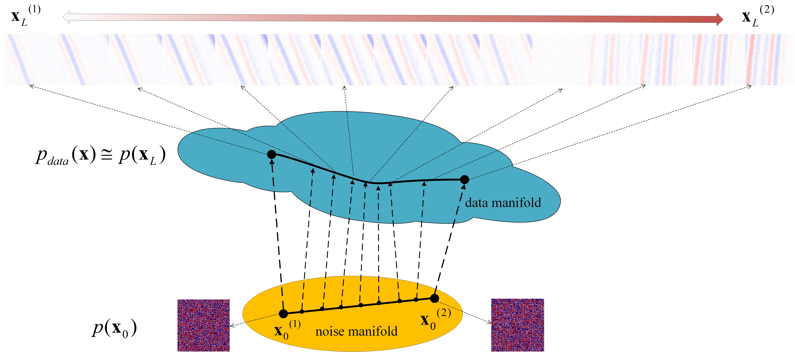
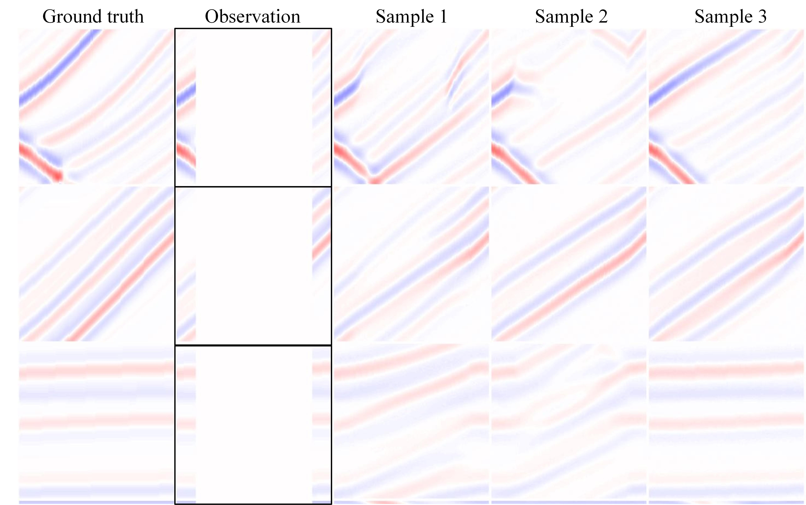

# Generative modeling of seismic data using score-based generative models

This repo contains the official implementation for the paper [Generative modeling of seismic data using score-based generative models](https://www.earthdoc.org/content/papers/10.3997/2214-4609.202410861). 

by [Chuangji Meng](https://github.com/mengchuangji).


**Note**: This project code is modified from [ncsnv2](https://github.com/ermongroup/ncsnv2), [AdversarialConsistentScoreMatching](https://github.com/AlexiaJM/AdversarialConsistentScoreMatching) and [VI-non-IID](https://github.com/mengchuangji/VI-Non-IID) .Thanks for their contributions.
-----------------------------------------------------------------------------------------

This is an example of real marmousi data and generated marmousi data.



(**From left to right**: 100 randomly collected samples of size 128*128 from target data set Marmousi , our
randomly generated 100 samples of size 128*128 

## Running Experiments

### Dependencies

Run the following to install all necessary python packages for our code.

```bash
pip install -r requirements.txt
```

### Project structure

`main.py` is the file that you should run for both training and sampling. Execute ```python main.py --help``` to get its usage description:

```
usage: main.py [-h] --config CONFIG [--seed SEED] [--exp EXP] --doc DOC
               [--comment COMMENT] [--verbose VERBOSE] [--test] [--sample]
               [--fast_fid] [--resume_training] [-i IMAGE_FOLDER] [--ni]

optional arguments:
  -h, --help            show this help message and exit
  --config CONFIG       Path to the config file
  --seed SEED           Random seed
  --exp EXP             Path for saving running related data.
  --doc DOC             A string for documentation purpose. Will be the name
                        of the log folder.
  --comment COMMENT     A string for experiment comment
  --verbose VERBOSE     Verbose level: info | debug | warning | critical
  --test                Whether to test the model
  --sample              Whether to produce samples from the model
  --fast_fid            Whether to do fast fid test
  --resume_training     Whether to resume training
  -i IMAGE_FOLDER, --image_folder IMAGE_FOLDER
                        The folder name of samples
  --ni                  No interaction. Suitable for Slurm Job launcher
```

Configuration files are in `config/`. You don't need to include the prefix `config/` when specifying  `--config` . 
All files generated when running the code is under the directory specified by `--exp`. They are structured as:

```bash
<exp> # a folder named by the argument `--exp` given to main.py
├── datasets # all dataset files
├── logs # contains checkpoints and samples produced during training
│   └── <doc> # a folder named by the argument `--doc` specified to main.py
│      ├── checkpoint_x.pth # the checkpoint file saved at the x-th training iteration
│      ├── config.yml # the configuration file for training this model
│      ├── stdout.txt # all outputs to the console during training
│      └── samples # all samples produced during training
├── fid_samples # contains all samples generated for fast fid computation
│   └── <i> # a folder named by the argument `-i` specified to main.py
│      └── ckpt_x # a folder of image samples generated from checkpoint_x.pth
├── image_samples # contains generated samples
│   └── <i>
│       └── image_grid_x.png # samples generated from checkpoint_x.pth       
└── tensorboard # tensorboard files for monitoring training
    └── <doc> # this is the log_dir of tensorboard
```

### Training

For example, we can train an NCSNv2 on Marmousi (mat file format) by running the following

```bash
python main_mcj_seismic.py --config marmousi.yml --doc marmousi
```

Log files will be saved in `<exp>/logs/marmousi`

For example, we can train an NCSNv2 on Marmousi and [Opensegy]("http://s3.amazonaws.com/open.source.geoscience/open_data) (mat or SEGY/SGY file format) by running the following

```bash
python main_mcj_seismic_mms_segy.py --config marmousi.yml --doc MmsSegyopenf
```

Log files will be saved in `<exp>/logs/MmsSegyopenf`.


### Sampling

If we want to sample from NCSNv2 on Marmousi or/and Opensegy, we can edit `marmousi.yml` to specify the `ckpt_id` under the group `sampling`, and then run the following

```bash
python main_mcj_seismic_sampling.py --sample --config marmousi.yml -i marmousi
```

Samples will be saved in `<exp>/image_samples/marmousi`.

We can interpolate between different samples (see more details in the paper). Just set `interpolation` to `true` and an appropriate `n_interpolations` under the group of `sampling` in `bedroom.yml`. We can also perform other tasks such as inpainting. Usages should be quite obvious if you read the code and configuration files carefully.

This is a schematic diagram of interpolating latent variables in latent space and generating samples.


## Pretrained Checkpoints


We provide two trained models and log files in files `<exp>/logs/marmousi_v2_nm` and `<exp>/logs/MmsSegyopenf`.  see [model](https://pan.baidu.com/s/1p5y_JC1AWSD7QCWRsSwMFw?pwd=1111), 提取码: 1111.

You can produce samples using it on all datasets we tested in the paper. It assumes the `--exp` argument is set to `exp`.

For example, you can also use the trained model directly for conditional sampling.  For more conditional sampling examples, please refer to [reference] (https://ieeexplore.ieee.org/abstract/document/10579850)


## References

If you find the code/idea useful for your research, please consider citing

```bib
@inproceedings{meng2024generative,
  title={Generative Modeling of Seismic Data Using Score-Based Generative Models},
  author={Meng, C and Gao, J and Tian, Y and Chen, H and Luo, R},
  booktitle={85th EAGE Annual Conference \& Exhibition (including the Workshop Programme)},
  volume={2024},
  number={1},
  pages={1--5},
  year={2024},
  organization={European Association of Geoscientists \& Engineers}
}
```

and/or our follow-up work

```bib
@ARTICLE{10579850,
  author={Meng, Chuangji and Gao, Jinghuai and Tian, Yajun and Chen, Hongling and Zhang, Wei and Luo, Renyu},
  journal={IEEE Transactions on Geoscience and Remote Sensing}, 
  title={Stochastic Solutions for Simultaneous Seismic Data Denoising and Reconstruction via Score-Based Generative Models}, 
  year={2024},
  volume={62},
  number={},
  pages={1-15},
  keywords={Noise reduction;Data models;Inverse problems;Noise;Mathematical models;Training;Stochastic processes;Denoising;Langevin dynamics;posterior sampling;reconstruction;score-based generative models (SGMs);stochastic solutions},
  doi={10.1109/TGRS.2024.3421597}}
```

### Contact
If you have any problem about our code, feel free to contact 4120105144@stu.edu.xjtu.cn, 2279767412@qq.com or describe your problem in Issues.

